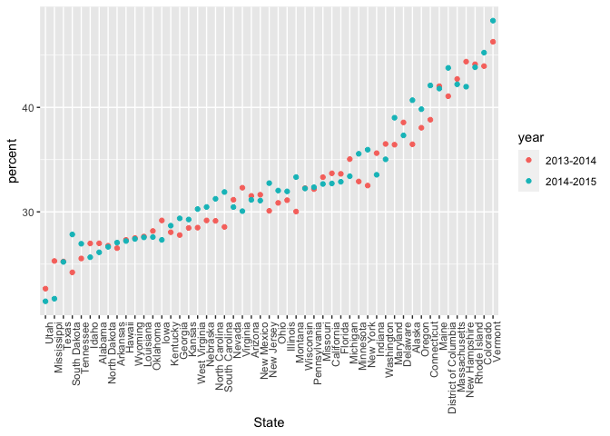
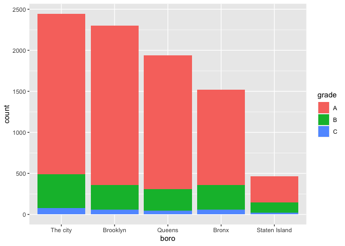

case_study
================
Yangyang Chen
2023-10-17

``` r
library(p8105.datasets)
library(rvest)
library(tidyverse)
```

    ## ── Attaching core tidyverse packages ──────────────────────── tidyverse 2.0.0 ──
    ## ✔ dplyr     1.1.3     ✔ readr     2.1.4
    ## ✔ forcats   1.0.0     ✔ stringr   1.5.0
    ## ✔ ggplot2   3.4.3     ✔ tibble    3.2.1
    ## ✔ lubridate 1.9.2     ✔ tidyr     1.3.0
    ## ✔ purrr     1.0.2     
    ## ── Conflicts ────────────────────────────────────────── tidyverse_conflicts() ──
    ## ✖ dplyr::filter()         masks stats::filter()
    ## ✖ readr::guess_encoding() masks rvest::guess_encoding()
    ## ✖ dplyr::lag()            masks stats::lag()
    ## ℹ Use the conflicted package (<http://conflicted.r-lib.org/>) to force all conflicts to become errors

## Strings and manipulations

``` r
string_vec = c("my", "name", "is", "jeff")

str_detect(string_vec, "e")
```

    ## [1] FALSE  TRUE FALSE  TRUE

``` r
str_detect(string_vec, "Jeff")
```

    ## [1] FALSE FALSE FALSE FALSE

``` r
string_vec = c(
  "i think we all rule for participating",
  "i think i have been caught",
  "i think this will be quite fun actually",
  "it will be fun, i think"
  )

str_detect(string_vec, "^i think") #beginnning
```

    ## [1]  TRUE  TRUE  TRUE FALSE

``` r
str_detect(string_vec, "i think$") #ending
```

    ## [1] FALSE FALSE FALSE  TRUE

``` r
string_vec = c(
  "Time for a Pumpkin Spice Latte!",
  "went to the #pumpkinpatch last weekend",
  "Pumpkin Pie is obviously the best pie",
  "SMASHING PUMPKINS -- LIVE IN CONCERT!!"
  )

str_detect(string_vec,"[Pp]umpkin")
```

    ## [1]  TRUE  TRUE  TRUE FALSE

``` r
str_detect(string_vec,"Pumpkin")
```

    ## [1]  TRUE FALSE  TRUE FALSE

``` r
string_vec = c(
  '7th inning stretch',
  '1st half soon to begin. Texas won the toss.',
  'she is 5 feet 4 inches tall',
  '3AM - cant sleep :('
  )

str_detect(string_vec, "^[0-9]")
```

    ## [1]  TRUE  TRUE FALSE  TRUE

``` r
str_detect(string_vec, "[0-9]")
```

    ## [1] TRUE TRUE TRUE TRUE

``` r
str_detect(string_vec, "^[0-9][a-zA-Z]")
```

    ## [1]  TRUE  TRUE FALSE  TRUE

``` r
string_vec = c(
  'Its 7:11 in the evening',
  'want to go to 7-11?',
  'my flight is AA711',
  'NetBios: scanning ip 203.167.114.66'
  )

str_detect(string_vec, "7.11")
```

    ## [1]  TRUE  TRUE FALSE  TRUE

``` r
string_vec = c(
  'The CI is [2, 5]',
  ':-]',
  ':-[',
  'I found the answer on pages [6-7]'
  )

str_detect(string_vec, "\\[") #\\double special character
```

    ## [1]  TRUE FALSE  TRUE  TRUE

``` r
str_detect(string_vec, "\\[[0-9]") #\\double special character
```

    ## [1]  TRUE FALSE FALSE  TRUE

## Factors

``` r
vec_sex = factor(c("male", "male", "female", "female"))
vec_sex
```

    ## [1] male   male   female female
    ## Levels: female male

``` r
as.numeric(vec_sex)
```

    ## [1] 2 2 1 1

``` r
vec_sex = fct_relevel(vec_sex, "male")
vec_sex
```

    ## [1] male   male   female female
    ## Levels: male female

``` r
as.numeric(vec_sex)
```

    ## [1] 1 1 2 2

``` r
# str_extract()
# fct_relabel()
```

## NSDUH

``` r
nsduh = "http://samhda.s3-us-gov-west-1.amazonaws.com/s3fs-public/field-uploads/2k15StateFiles/NSDUHsaeShortTermCHG2015.htm"

table_marj = 
  read_html(nsduh) |> 
  html_table() |> 
  first() |> 
  slice(-1) 
```

need to tidy this!

``` r
marj_df = 
  table_marj |> 
  select(-contains("P Value")) |> 
  pivot_longer(
    -State,
    names_to = "age_year",
    values_to = "percent"
  ) |> 
  separate(age_year, into = c("age", "year"), sep ="\\(") |> 
  mutate(
  year = str_replace(year, "\\)", ""),
  percent = str_replace(percent, "[a-c]$", ""),
  percent = as.numeric(percent)) |> 
  filter(!(State %in% c("Total U.S.", "Northeast", "Midwest", "South", "West")))
```

``` r
marj_df |> 
  filter(age == "18-25") |> 
  mutate(State = fct_reorder(State, percent)) |> 
  ggplot(aes(x = State, y = percent, color = year)) + 
  geom_point() + 
  theme(axis.text.x = element_text(angle = 90, hjust = 1))
```

<!-- -->

## NYC Restaurant Inspections

``` r
data("rest_inspec")

rest_inspec |> 
  group_by(boro, grade) |> 
  summarize(n = n()) |> 
  pivot_wider(names_from = grade, values_from = n) 
```

    ## `summarise()` has grouped output by 'boro'. You can override using the
    ## `.groups` argument.

    ## # A tibble: 6 × 8
    ## # Groups:   boro [6]
    ##   boro              A     B     C `Not Yet Graded`     P     Z  `NA`
    ##   <chr>         <int> <int> <int>            <int> <int> <int> <int>
    ## 1 BRONX         13688  2801   701              200   163   351 16833
    ## 2 BROOKLYN      37449  6651  1684              702   416   977 51930
    ## 3 MANHATTAN     61608 10532  2689              765   508  1237 80615
    ## 4 Missing           4    NA    NA               NA    NA    NA    13
    ## 5 QUEENS        35952  6492  1593              604   331   913 45816
    ## 6 STATEN ISLAND  5215   933   207               85    47   149  6730

OR

``` r
rest_inspec |> 
  count(boro,grade) |> 
  pivot_wider(names_from = grade, values_from = n) |> 
  knitr::kable()
```

| boro          |     A |     B |    C | Not Yet Graded |   P |    Z |    NA |
|:--------------|------:|------:|-----:|---------------:|----:|-----:|------:|
| BRONX         | 13688 |  2801 |  701 |            200 | 163 |  351 | 16833 |
| BROOKLYN      | 37449 |  6651 | 1684 |            702 | 416 |  977 | 51930 |
| MANHATTAN     | 61608 | 10532 | 2689 |            765 | 508 | 1237 | 80615 |
| Missing       |     4 |    NA |   NA |             NA |  NA |   NA |    13 |
| QUEENS        | 35952 |  6492 | 1593 |            604 | 331 |  913 | 45816 |
| STATEN ISLAND |  5215 |   933 |  207 |             85 |  47 |  149 |  6730 |

``` r
inspection_df = 
  rest_inspec |> 
  filter(grade %in% c("A", "B", "C"), boro != "Missing") |> 
  mutate(boro = str_to_title(boro))
```

``` r
inspection_df |> 
  filter(str_detect(dba, "PIZZA")) |> 
  count(boro)
```

    ## # A tibble: 5 × 2
    ##   boro              n
    ##   <chr>         <int>
    ## 1 Bronx          1519
    ## 2 Brooklyn       2299
    ## 3 Manhattan      2445
    ## 4 Queens         1937
    ## 5 Staten Island   466

``` r
inspection_df |> 
  filter(str_detect(dba, "PIZZA")) |> 
  mutate(boro = fct_infreq(boro)) |> #ordered and fatorized data by frequenncy
  ggplot(aes(x = boro, fill = grade)) +
  geom_bar()
```

<!-- -->

``` r
inspection_df |> 
  filter(str_detect(dba, "PIZZA")) |> 
  mutate(
    boro = fct_infreq(boro),#ordered and fatorized data by frequenncy
    #boro = str_replace(boro, "Manhattan", "The City") # DON'T! Undo ordered frequency.
    #boro = replace(boro, which(boro == "Manhattan"), "The City") # DON'T! Doesn't work, if "Manhattan" doesn't exist, it will place it with "NA", and we doesn't expect it
    boro = fct_recode(boro, "The city" = "Manhattan") # It's worked!
     ) |> 
  ggplot(aes(x = boro, fill = grade)) +
  geom_bar()
```

<!-- -->
